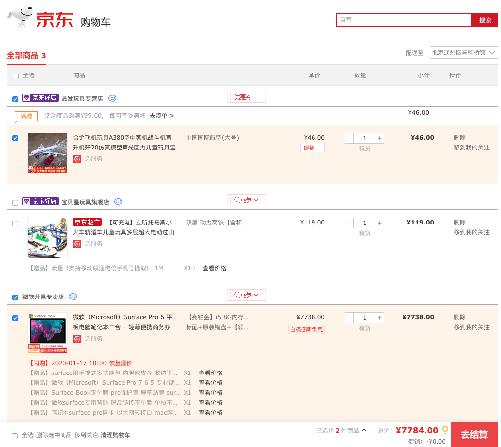
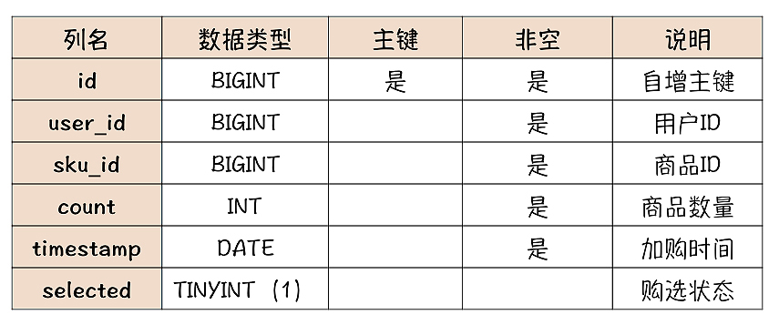

# 复杂而又重要的购物车系统，应该如何设计？

说一下购物车系统的存储该如何设计

首先，我们来看购物车系统的主要功能是什么。**就是在用户选购商品时，下单之前，暂存用户想要购买的商品**。购物车对数据可靠性要求不高，性能也没有特别的要求，在整个电商系统中，看起来是相对比较容易设计和实现的一个子系统。

购物车系统的功能，主要的就三个：

- 把商品加入购物车（后文称「 **加购** 」）
- 购物车列表
- 发起结算下单，再加上一个在所有界面都要显示的购物车小图标。

支撑购物车的这几个功能，**对应的存储模型应该怎么设计？**很简单，**只要一个「购物车」实体就够了**。它的主要属性有什么？你打开京东的购物车页面，对着抄就设计出来了：

- SKUID（商品 ID）

- 数量

- 加购时间

- 勾选状态

  就是在购物车界面中，每件商品前面的那个小对号，表示在结算下单时，是不是要包含这件商品



至于商品价格和总价、商品介绍等等这些信息，都可以 **实时从其他系统中获取，不需要购物车系统来保存**。

购物车的功能虽然很简单，但是在设计购物车系统的存储时，仍然有一些 **特殊的问题** 需要考虑。

## 设计购物车存储时需要把握什么原则？

比如下面这几个问题：

1. 用户没登录，在浏览器中加购，关闭浏览器再打开，刚才加购的商品还在不在？

2. 用户没登录，在浏览器中加购，然后登录，刚才加购的商品还在不在？

3. 关闭浏览器再打开，上一步加购的商品在不在？

4. 再打开手机，用相同的用户登录，第二步加购的商品还在不在呢？

   

上面这几个问题是不是有点儿绕？没关系，我们先简单解释一下这四个问题：

1. 如果用户没登录，加购的商品也会被保存在用户的电脑里，这样即使关闭浏览器再打开，购物车的商品仍然存在。

2. 如果用户先加购，再登录，登录前加购的商品就会被自动合并到用户名下，所以登录后购物车中仍然有登录前加购的商品。
3. 关闭浏览器再打开，这时又变为未登录状态，但是之前未登录时加购的商品已经被合并到刚刚登录的用户名下了，所以购物车是空的。
4. 使用手机登录相同的用户，看到的就是该用户的购物车，这时无论你在手机 App、电脑还是微信中登录，只要是相同的用户，看到是同一个购物车，所以第二步加购的商品是存在的。

所以，上面这四个问题的答案依次是：存在、存在、不存在、存在。


**要解决上面这些问题，其实只要在存储设计时，把握这几个原则就可以了：**

1. 如果未登录，需要临时暂存购物车的商品；

2. 用户登录时，把暂存购物车的商品合并到用户购物车中，并且清除暂存购物车；

3. 用户登陆后，购物车中的商品，需要在浏览器、手机 APP 和微信等等这些终端中都保持同步。

##  如何设计「暂存购物车」的存储？

我们先来看下暂存购物车的存储该怎么实现。暂存购物车应该存在 **客户端** 还是 **存在服务端？**

如果保存在服务端，那每个暂存购物车都需要有一个全局唯一的标识，这个标识并不太容易设计，并且，存在服务端还要浪费服务端的资源。所以，肯定是保存在客户端好，既可以节约服务器的存储资源，也没有购物车标识的问题，因为每个客户端就保存它自己唯一一个购物车就可以了，不需要标识。

客户端的存储可以选择的不太多：Session、Cookie 和 LocalStorage，其中浏览器的 LocalStorage 和 App 的本地存储是类似的，我们都以 LocalStorage 来代表。

存在哪儿最合适？SESSION 是不太合适的，原因是，SESSION 的保留时间短，而且 SESSION 的数据实际上还是保存在服务端的。剩余的两种存储，Cookie 和 LocalStorage 都可以用来保存购物车数据，选择哪种方式更好呢？各有优劣。

**在我们这个场景中，使用 Cookie 和 LocalStorage 最关键的区别是**，客户端和服务端的每次交互，都会自动带着 Cookie 数据往返，这样服务端可以读写客户端 Cookie 中的数据，而 LocalStorage 里的数据，只能由客户端来访问。

- 使用 Cookie 存储

  实现起来比较简单，加减购物车、合并购物车的过程中，由于服务端可以读写 Cookie，这样全部逻辑都可以在服务端实现，并且客户端和服务端请求的次数也相对少一些。

- 使用 LocalStorage 存储

  实现相对就复杂一点儿，客户端和服务端都要实现一些业务逻辑，但 LocalStorage 的好处是，它的存储容量比 Cookie 的 4KB 上限要大得多，而且不用像 Cookie 那样，无论用不用，每次请求都要带着，可以节省带宽。

所以，选择 Cookie 或者是 LocalStorage 来存储暂存购物车都是没问题的，你可以根据它俩各自的优劣势来选择。比如你设计的是个小型电商，那用 Cookie 存储实现起来更简单。再比如，你的电商是面那种批发的行业用户，用户需要加购大量的商品，那 Cookie 可能容量不够用，选择 LocalStorage 就更合适。

不管选择哪种存储，暂存购物车保存的数据格式都是一样的，参照我们实体模型来设计就可以，我们可以直接用 JSON 表示：

```json
{
    "cart": [
        {
            "SKUID": 8888,
            "timestamp": 1578721136,
            "count": 1,
            "selected": true
        },
        {
            "SKUID": 6666,
            "timestamp": 1578721138,
            "count": 2,
            "selected": false
        }
    ]
}
```

## 如何设计「用户购物车」的存储？

接下来，我们再来看下用户购物车的存储该怎么实现。**因为用户购物车必须要保证多端的数据同步，所以数据必须保存在服务端**。常规的思路是，设计一张购物车表，把数据存在 MySQL 中。这个表的结构同样可以参照刚刚讲的实体模型来设计：



注意，需要在 user_id 上建一个索引，因为查询购物车表时，都是以 user_id 作为查询条件来查询的。

你也可以选择更快的 Redis 来保存购物车数据，以用户 ID 作为 Key，用一个 Redis 的 HASH 作为 Value 来保存购物车中的商品。比如：

```json
{
    "KEY": 6666,
    "VALUE": [
        {
            "FIELD": 8888,
            "FIELD_VALUE": {
                "timestamp": 1578721136,
                "count": 1,
                "selected": true
            }
        },
        {
            "FIELD": 6666,
            "FIELD_VALUE": {
                "timestamp": 1578721138,
                "count": 2,
                "selected": false
            }
        }
    ]
}
```

这里为了便于你理解，我们用 JSON 来表示 Redis 中 HASH 的数据结构，其中 KEY 中的值 6666 是一个用户 ID，FIELD 里存放的是商品 ID，FIELD_VALUE 是一个 JSON 字符串，保存加购时间、商品数量和勾选状态。

大家都知道，从读写性能上来说，Redis 是比 MySQL 快非常多的，**那是不是用 Redis 就一定比用 MySQL 更好呢？我们来比较一下使用 MySQL 和 Redis 两种存储的优劣势**：

1. 显然使用  **Redis**  性能要比 MySQL 高出至少一个量级，**响应时间更短，可以支撑更多的并发请求**，「天下武功，唯快不破」，这一点 Redis 完胜。

2. **MySQL 的数据可靠性是要好于 Redis 的** ，因为 Redis 是异步刷盘，如果出现服务器掉电等异常情况，Redis 是有可能会丢数据的。但考虑到购物车里的数据，对可靠性要求也没那么苛刻，丢少量数据的后果也就是，个别用户的购物车少了几件商品，问题也不大。所以，在购物车这个场景下，Redis 的数据可靠性不高这个缺点，并不是不能接受的。

3. **MySQL 的另一个优势是，它支持丰富的查询方式和事务机制**，这两个特性，对我们今天讨论的这几个购物车核心功能没什么用。但是，每一个电商系统都有它个性化的需求，如果需要以其他方式访问购物车的数据，**比如说，统计一下今天加购的商品总数** ，这个时候，使用 MySQL 存储数据，就很容易实现，而使用 Redis 存储，查询起来就非常麻烦而且低效。

综合比较下来，考虑到需求总是不断变化，还是 **更推荐你使用 MySQL 来存储购物车数据**。如果追求性能或者高并发，也可以选择使用 Redis。

你可以感受到，我们  **设计存储架构的过程就是一个不断做选择题的过程**。很多情况下，可供选择的方案不止一套，选择的时候需要考虑实现  **复杂度、性能、系统可用性、数据可靠性、可扩展性等等非常多的条件**。需要强调的是，**这些条件每一个都不是绝对不可以牺牲的，不要让一些 「所谓的常识」禁锢了你的思维。**

**比如，一般我们都认为数据是绝对不可以丢的**，也就是说不能牺牲数据可靠性。但是，像刚刚讲到的用户购物车的存储，**使用 Redis 替代 MySQL，就是牺牲了数据可靠性换取高性能**。我们仔细分析后得出，很低概率的情况下丢失少量数据，是可以接受的。性能提升带来的收益远大于丢失少量数据而付出的代价， **这个选择就是划算的**。

如果说不考虑需求变化这个因素，牺牲一点点数据可靠性，换取大幅性能提升，选择 Redis 才是最优解。

##  小结

今天我们讲了购物车系统的存储该如何设计。

购物车系统的主要功能包括：加购、购物车列表页和结算下单。核心的实体就只有一个 「购物车」实体，它至少要包括：SKUID、数量、加购时间和勾选状态这几个属性。

在给购物车设计存储时，为了确保购物车内的数据在多端保持一致，以及用户登录前后购物车内商品能无缝衔接，除了每个用户的 「用户购物车」之外还要实现一个 「暂存购物车」保存用户未登录时加购的商品，并在用户登录后自动合并「暂存购物车」和「用户购物车」。

暂存购物车存储在客户端浏览器或者 App 中，可以选择存放到 Cookie 或者 LocalStorage 中。用户购物车保存在服务端，可以选择使用 Redis 或者是 MySQL 存储，使用 Redis 存储会有更高的性能，可以支撑更多的并发请求，使用 MySQL 是更常规通用的方式，便于应对变化，系统的扩展性更好。

## 思考题

课后请你思考一下，既然用户的购物车数据存放在 MySQL 或者是 Redis 中各有优劣势。那能不能把购物车数据存在 MySQL 中，并且用 Redis 来做缓存呢？这样不就可以兼顾两者的优势了么？这样做是不是可行？如果可行，如何来保证 Redis 中的数据和 MySQL 中的数据是一样的呢？

这样来看：

用Redis给购物车库做缓存，技术上肯定是可行的。但是有两个问题需要思考一下。

第一个问题是，值不值得这样做？因为每个人的购物车都是不一样的，所以这个缓存它的读写比差距不会很大，缓存的命中率不会太高，缓存的收益有限，为了维护缓存，还要增加系统的复杂度。所以我们就要自行权衡一下，是不是值得的问题。我的观点是，除了超大规模的系统以外，没有必要设置这个缓存。

第二个问题是，如果我们非要做这样一个缓存，用什么缓存更新策略更好呢？这里我先卖个关子，在《11 | MySQL如何应对高并发（一）：使用缓存保护MySQL》这节课中，我们会专门讲到几种常用的缓存策略，你可以学完这节课之后，再回过头来想一下这个问题。

笔者认为：

这样做是可行的，保证双写一致的情况，可以使用如下的方式来做：

1. 新增：直接入库
2. 查询：先走缓存、缓存不命中，再走数据库
3. 更新：入库并更新缓存

更详细的内容请参考   [数据库 + 缓存双写一致性解决方案](../../cache-pdp/040.md)

但是有一个疑问：缓存的使用场景是 **读多写少**，而且是 **用户自己访问自己的**，明显的是写多读少的场景，不太适合了。

如果是考虑并发问题，可以考虑将将 redis 做主要的存储，然后异步写入 mysql 中，做一些分析的时候，就从 mysql 中查询；

