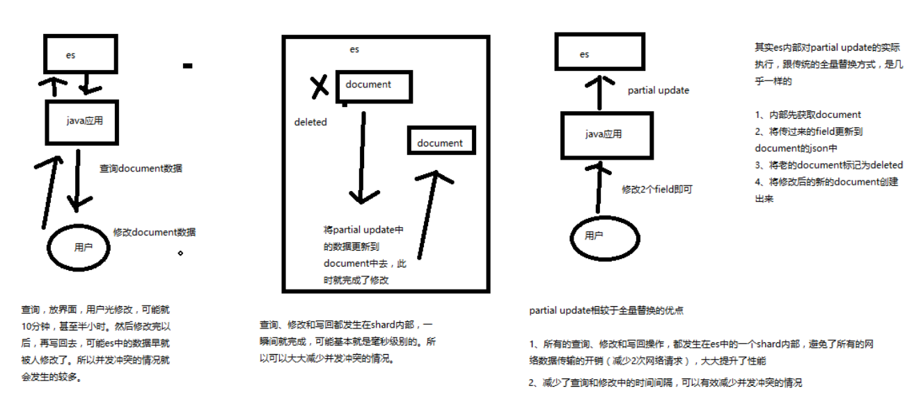
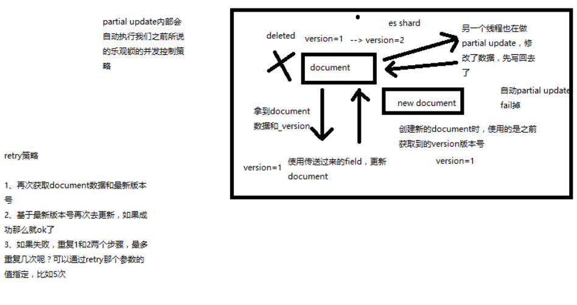

# partial update

[[toc]]

本章共记录原教程的 3 个章节，他们都是关于 partial update 的知识

- 第23节：图解 partial update 实现原理以及动手实战演练
- 第24节：上机动手实战演练基于 groovy 脚本进行 partial update
- 第25节：图解 partial update 乐观锁并发控制原理以及相关操作讲解

## 图解实现原理与实战演练

### 什么是 partial update？

`PUT /index/type/id`，创建文档&替换文档，就是一样的语法

一般对应到应用程序中，每次的执行流程基本是这样的：

1. 应用程序先发起一个 get 请求，获取到 document，展示到前台界面，供用户查看和修改
2. 用户在前台界面修改数据，发送到后台
3. 后台代码，会将用户修改的数据在内存中进行执行，然后封装好修改后的全量数据
4. 然后发送 PUT 请求，到 es 中，进行全量替换
5. es 将老的 document 标记为 deleted，然后重新创建一个新的 document

partial update 语法

```json
post /index/type/id/_update
{
   "doc": {
      "要修改的少数几个field即可，不需要全量的数据"
   }
}
```

看起来，好像就比较方便了，每次就传递少数几个发生修改的 field 即可，不需要将全量的 document 数据发送过去

[之前在快速上手里面有讲到过](../quick-start-texample/06-crud.md#修改商品：更新文档)

### 图解 partial update 实现原理以及其优点
partial update，看起来很方便的操作，实际内部的原理是什么样子的，然后它的优点是什么



**要明白在原理上与全量替换方法几乎一致：**

1. 内部先获取 document
2. 将传递过来的 field 更新到 document 的 json 中
3. 将老的 document 标记为 deleted
4. 将修改后的新的 document 创建出来

**partial update 相较于全量替换的优点：**

1. 所有的查询、修改和协会操作，都发生在 es 中的一个 shard 内部

    避免网络数据传输的开销（减少两次网络请求，查询写回），大大提升性能
2. 减少了查询和修改中的间隔，可有效减少并发冲突情况

    先获取数据，再修改，这中间可能会存在号几分钟的人工填写时间，
    如果存在并发，则需要多次获取版本号再写入的操作。
    而这里在一个 shard 内部就完成了这些

### 演练

```json
PUT /test_index/test_type/10
{
  "test_field1": "test1",
  "test_field2": "test2"
}

POST /test_index/test_type/10/_update
{
  "doc": {
    "test_field2": "updated test2"
  }
}

```


## groovy 语法实现

es，其实是有个内置的脚本支持的，可以基于 groovy 脚本实现各种各样的复杂操作

本节基于 groovy 脚本，简单讲解如何执行 partial update

es scripting module，我们会在高手进阶篇去讲解，这里就只是初步讲解一下

### 内置脚本
什么是内置脚本？ 语法内容通过 api 发送

新增一条数据，通过这条数据的来讲解怎么操作

```json
PUT /test_index/test_type/11
{
  "num": 0,
  "tags": []
}
```

自增操作

```json
POST /test_index/test_type/11/_update
{
  "script": "ctx._source.num+=1"
}

----- 响应

{
  "_index": "test_index",
  "_type": "test_type",
  "_id": "11",
  "_version": 2,
  "result": "updated",
  "_shards": {
    "total": 2,
    "successful": 1,
    "failed": 0
  }
}
```

数组操作

```json
POST /test_index/test_type/11/_update
{
  "script": "ctx._source.tags.add('xx')"
}
```

这些语法在官方文档中有介绍，比如后面的 painless 脚本语法介绍中给出的官方文档链接

### 外置脚本

什么是外置脚本？ 语法内容存储在 `/config/scripts` 目录中的文件中，通过 api 指定哪一个文件获取文件中的脚本内容

test-add-tags.groovy

```groovy
ctx._source.tags+=new_tag
```

```json
POST /test_index/test_type/11/_update
{
  "script": {
    "lang": "groovy",
    "file": "test-add-tags",
    "params": {
      "new_tag":"tag1"
    }
  }
}
```

::: tip
外置脚本里面的语法放在内置脚本中的话，结果是不一样的，
内置中会把数组的 json 串当成字符串操作，如下
```json
"_source": {
    "num": 1,
    "tags": "[xx, tag1]tag2"
  }
```
:::

### 用脚本删除文档

脚本做的事情：当 num 等于指定值的时候，就删除，否则不做操作

test-delete-document.groovy

```groovy
ctx.op = ctx._source.num == count ? 'delete' : 'none'
```

```json
POST /test_index/test_type/11/_update
{
  "script": {
    "lang": "groovy",
    "file": "test-delete-document",
    "params": {
      "count": 1
    }
  }
}
```

::: tip
注意 count 的值类型，如果写成 “1” 的话，是不会被匹配的
:::

### upsert 操作

什么是 upsert ？ 可以理解为 document 存在就更新，不存在则插入

刚刚把 id=11 的 document 删除了，现在直接更新操作，会报错

```json
POST /test_index/test_type/11/_update
{
  "doc": {
    "num": 1
  }
}

------ 响应

{
  "error": {
    "root_cause": [
      {
        "type": "document_missing_exception",
        "reason": "[test_type][11]: document missing",
        "index_uuid": "g4RJx2v8TXK95LdwlhRx5A",
        "shard": "0",
        "index": "test_index"
      }
    ],
    "type": "document_missing_exception",
    "reason": "[test_type][11]: document missing",
    "index_uuid": "g4RJx2v8TXK95LdwlhRx5A",
    "shard": "0",
    "index": "test_index"
  },
  "status": 404
}
```

使用脚本实现：如果指定的 document 不存在，就执行 upsert 中的初始化操作；如果指定的 document 存在，就执行 doc 或者 script 指定的 partial update 操作

```json
POST /test_index/test_type/11/_update
{
   "script" : "ctx._source.num+=1",
   "upsert": {
       "num": 0,
       "tags": []
   }
}
```

可以执行两次该操作，查看内容。

## `painless` 脚本语法

::: tip

本小节是后补的，实际项目中用到了，可能是与这个版本不一致，默认的脚本语言已经不是 groovy 了

这里的创建索引等功能，是后续章节的用法

:::

默认脚本使用的是  `painless` ，这个在 [官方文档中有介绍](https://www.elastic.co/guide/en/elasticsearch/reference/5.5/modules-scripting-painless.html)，该语言的 API 继承了 JAVA 的 **部分类的部分方法**，这个说明在 官方文档 [附录 A 中有说明](https://www.elastic.co/guide/en/elasticsearch/painless/5.5/painless-api-reference.html#painless-api-reference-String) 哪些方法可以使用 

比如下面的查询和批量更新中都可以使用该脚本处理

```json
// 先创建索引，主要目的是让 email 的字段为 keyword，不然在查询的时候会报错（这个错误后续章节学完后可以自行解决的）
PUT /test_index2
{
  "mappings": {
    "test_type2": {
      "properties": {
        "email": {
          "type": "keyword"
        }
      }
    }
  }
}

// 插入两条测试数据
PUT /test_index2/test_type2/110
{
    "email":"99299684@qq.com"
}
PUT /test_index2/test_type2/111
{
    "email":"99299684@163.com"
}
```

看下两条数据在数据库中的样子

```json
GET /test_index2/test_type2/_search
```

响应

```json
{
  "took": 1,
  "timed_out": false,
  "_shards": {
    "total": 5,
    "successful": 5,
    "failed": 0
  },
  "hits": {
    "total": 2,
    "max_score": 1,
    "hits": [
      {
        "_index": "test_index2",
        "_type": "test_type2",
        "_id": "110",
        "_score": 1,
        "_source": {
          "email": "99299684@qq.com"
        }
      },
      {
        "_index": "test_index2",
        "_type": "test_type2",
        "_id": "111",
        "_score": 1,
        "_source": {
          "email": "99299684@163.com"
        }
      }
    ]
  }
}
```


### 查询中使用 painless script

查询的时候，使用脚本将 email 字段处理成  test 字段返回，并使用脚本语言的字符串函数对 email 字段进行裁剪操作

```json
GET /test_index2/test_type2/_search
{
  "size": 1, 
  "script_fields": {
    "test": {
      "script": {
        "lang": "painless",
        "inline": "doc['email'].value.substring(doc['email'].value.indexOf('@'))"
      }
    }
  }
}
```

响应

```json
{
  "took": 1,
  "timed_out": false,
  "_shards": {
    "total": 5,
    "successful": 5,
    "failed": 0
  },
  "hits": {
    "total": 2,
    "max_score": 1,
    "hits": [
      {
        "_index": "test_index2",
        "_type": "test_type2",
        "_id": "110",
        "_score": 1,
        "fields": {
          "test": [
            "@qq.com"
          ]
        }
      }
    ]
  }
}
```

### `_update_by_query` 批量更新中使用 painless script

对所有文档新增一个 emailSuffix 字段，emailSuffix 字段的值是 email 字段邮箱后缀

```json
POST /test_index2/test_type2/_update_by_query
{
    "query": {
      "match_all": {}
    },
    "script": {
        "inline": "ctx._source.emailSuffix = ctx._source.email.substring(ctx._source.email.indexOf('@')+1)"
    }
}
```

查询看看结果

```
GET /test_index2/test_type2/_search
```

响应

```json
{
  "took": 1,
  "timed_out": false,
  "_shards": {
    "total": 5,
    "successful": 5,
    "failed": 0
  },
  "hits": {
    "total": 2,
    "max_score": 1,
    "hits": [
      {
        "_index": "test_index2",
        "_type": "test_type2",
        "_id": "110",
        "_score": 1,
        "_source": {
          "emailSuffix": "qq.com",
          "email": "99299684@qq.com"
        }
      },
      {
        "_index": "test_index2",
        "_type": "test_type2",
        "_id": "111",
        "_score": 1,
        "_source": {
          "emailSuffix": "163.com",
          "email": "99299684@163.com"
        }
      }
    ]
  }
}
```

## 监控批量更新状态

如上，使用脚本批量更新的话，当数据量很大的时候，就需要监控他的执行状态了

```
GET _tasks?detailed=true&actions=*byquery
```


## 图解乐观锁并发控制原理与操作



1. partial update 内置乐观锁并发控制
2. retry_on_conflict

    retry 策略大致如下：

    1. 再次获取 document 数据和最新版本
    2. 基于最新版本号再次去更新

    重试的次数为指定的次数，次数用完，还更新不了就失败了
  
3. `_version`

```json
POST /test_index/test_type/11/_update?retry_on_conflict=2
{
  "doc": {
    "num" : 2
  }
}
```
