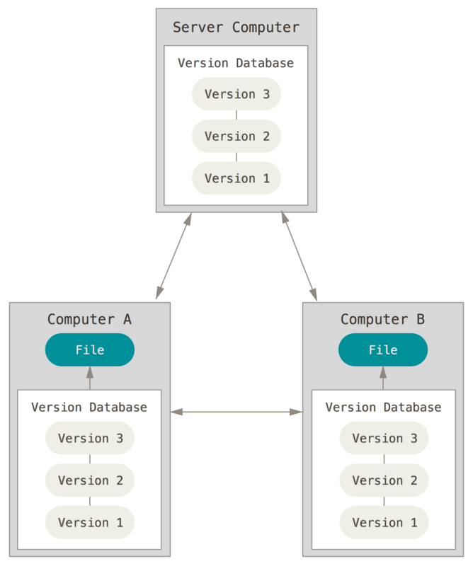

# 起步

## 版本控制

目前有三种版本控制方式：

- 本地版本控制系统

   它的工作原理是在硬盘上保存补丁集（补丁是指文件修订前后的变化）；通过应用所有的补丁，可以重新计算出各个版本的文件内容。

- 集中化版本控制系统

  都有一个单一的集中管理的服务器，保存所有文件的修订版本，而协同工作的人们都通过客户端连到这台服务器，取出最新的文件或者提交更新。 多年以来，这已成为版本控制系统的标准做法。

  缺点就是有单点故障

- 分布式版本控制系统（Distributed Version Control System，简称 DVCS）

   客户端并不只提取最新版本的文件快照，而是把代码仓库完整地镜像下来。 这么一来，任何一处协同工作用的服务器发生故障，事后都可以用任何一个镜像出来的本地仓库恢复。 因为每一次的克隆操作，实际上都是一次对代码仓库的完整备份。



Git 是 **分布式版本控制系统**

## Git 基础

 请注意接下来的内容非常重要，若你理解了 Git 的思想和基本工作原理，用起来就会知其所以然，游刃有余。

### 直接记录快照，而非差异比较

其他的版本控制系统使用记录差异比较（基础文件 + 补丁方式），如下图所示


 反之，Git 更像是把数据看作是对小型文件系统的一组快照。 每次你提交更新，或在 Git 中保存项目状态时，它主要对当时的全部文件制作一个快照并保存这个快照的索引。 为了高效，如果文件没有修改，Git 不再重新存储该文件，而是只保留一个链接指向之前存储的文件。 Git 对待数据更像是一个 **快照流**。


### 近乎所有操作都是本地执行

绝大多数操作都只需要访问本地文件和资源。这也意味着你离线或者没有 VPN 时，几乎可以进行任何操作。 如你在飞机或火车上想做些工作，你能愉快地提交，直到有网络连接时再上传。

### Git 保证完整性

Git 中所有数据在存储前都计算校验和，然后以校验和来引用。 这意味着不可能在 Git 不知情时更改任何文件内容或目录内容。 这个功能建构在 Git 底层，是构成 Git 哲学不可或缺的部分。 若你在传送过程中丢失信息或损坏文件，Git 就能发现。

### Git 一般只添加数据

你执行的 Git 操作，几乎只往 Git 数据库中增加数据。 很难让 Git 执行任何不可逆操作，或者让它以任何方式清除数据。 同别的 VCS 一样，未提交更新时有可能丢失或弄乱修改的内容；但是一旦你提交快照到 Git 中，就难以再丢失数据，特别是如果你定期的推送数据库到其它仓库的话。

### 三种状态

下面的概念很重要，有三种状态：

- 已提交（committed）

  数据已经安全的保存在本地数据库中

- 已修改（modified）

  修改了文件，但还没保存到数据库中

- 已暂存（staged）

  对一个已修改文件的当前版本做了标记，使之包含在下次提交的快照中

由此引入 Git 项目的三个工作区域的概念：Git 仓库、工作目录以及暂存区域。


- Git 仓库

  用来保存项目的元数据和对象数据库的地方，这是 Git 中最重要的部分，从其它计算机克隆仓库时，拷贝的就是这里的数据。

- 工作目录

  对项目的某个版本独立提取出来的内容。 这些从 Git 仓库的压缩数据库中提取出来的文件，放在磁盘上供你使用或修改。

- 暂存区域

  是一个文件，保存了下次将提交的文件列表信息，一般在 Git 仓库目录中

基本的 Git 工作流程如下：

1. 在工作目录中修改文件。
2. 暂存文件，将文件的快照放入暂存区域。
3. 提交更新，找到暂存区域的文件，将快照永久性存储到 Git 仓库目录。

## 初次运行 Git 前的配置

既然已经在系统上安装了 Git，你会想要做几件事来定制你的 Git 环境。 每台计算机上只需要配置一次，程序升级时会保留配置信息。 你可以在任何时候再次通过运行命令来修改它们。

使用 git config 工具来帮助设置控制 Git 外观和行为的配置变量。 这些变量存储在三个不同的位置：

1. `/etc/gitconfig` ：包含系统上每一个用户及他们仓库的通用配置。

    如果使用带有 –system 选项的 git config 时，它会从此文件读写配置变量。

2. `~/.gitconfig 或 ~/.config/git/config`

     只针对当前用户。 可以传递 –global 选项让 Git 读写此文件。

     在 windows 上，就是 `C:\Users\当前用户\.gitconfig`

3. `.git/config`：当前使用仓库目录中的配置文件

采用就近覆盖原则，3 是最近的，将会覆盖 2 中的同名配置

在 Windows 系统中，Git 会查找 $HOME 目录下（一般情况下是 `C:\Users\$USER`）的 `.gitconfig` 文件。 Git 同样也会寻找 `/etc/gitconfig` 文件，不过是在安装 Git 时所选的目标位置

### 用户信息

当安装完 Git 应该做的第一件事就是设置你的用户名称与邮件地址。 这样做很重要，因为每一个 Git 的提交都会使用这些信息，并且它会写入到你的每一次提交中，不可更改：

```bash
$ git config --global user.name "John Doe"
$ git config --global user.email johndoe@example.com
```

如果想在每个项目下使用不同的用户名提交，则可以使用不带 `--global` 的命令来设置。

### 检查配置信息

如果想要检查你的配置，可以使用 `git config –list` 命令来列出所有 Git 当时能找到的配置。

```bash
$ git config --list
user.name=John Doe
user.email=johndoe@example.com
color.status=auto
color.branch=auto
color.interactive=auto
color.diff=auto
...
```

如果看到了重复的变量名，这是因为前面说过会从不同的配置文件获取，当然只有最后找到的配置会生效。

还可以通过  `git config <key>` 来检查 Git 的某一项配置

```bash
$ git config user.name
John Doe
```

## 获取帮助

若你使用 Git 时需要获取帮助，有三种方法可以找到 Git 命令的使用手册：

```bash
$ git help <verb>
$ git <verb> --help
$ man git-<verb>
```

例如，要想获得 config 命令的手册，执行

```
$ git help config
```

以上命令都是离线帮助文档