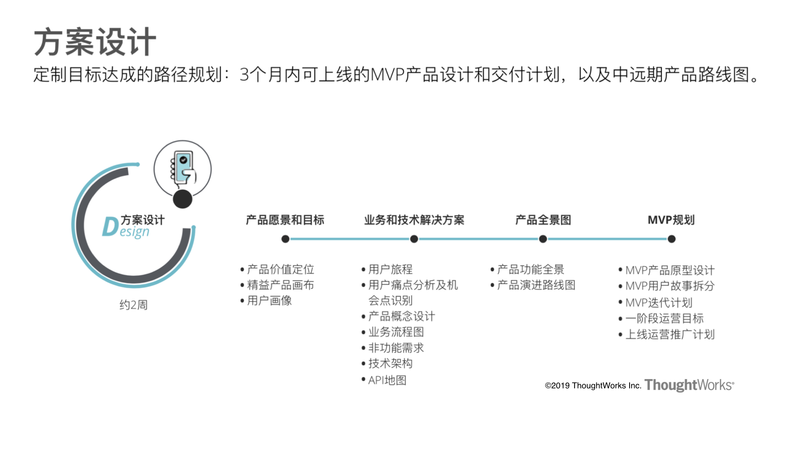
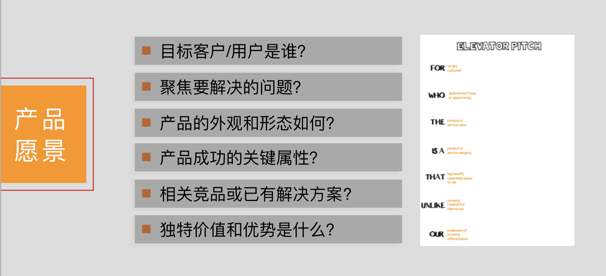
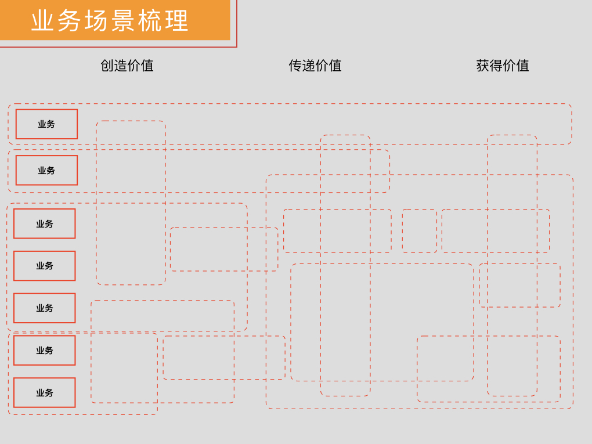
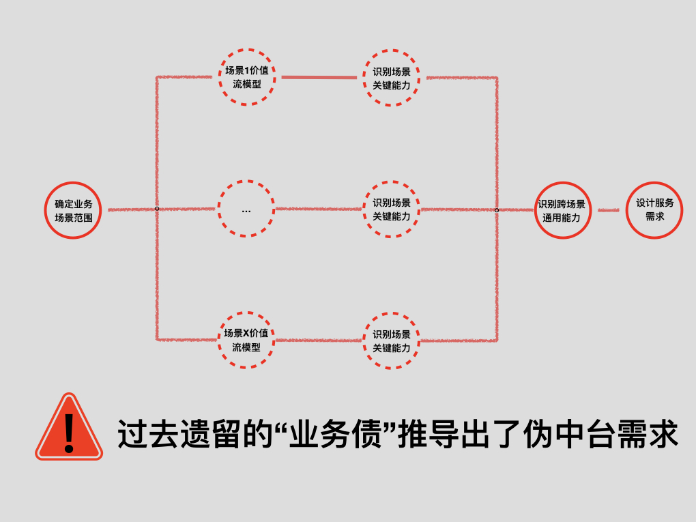
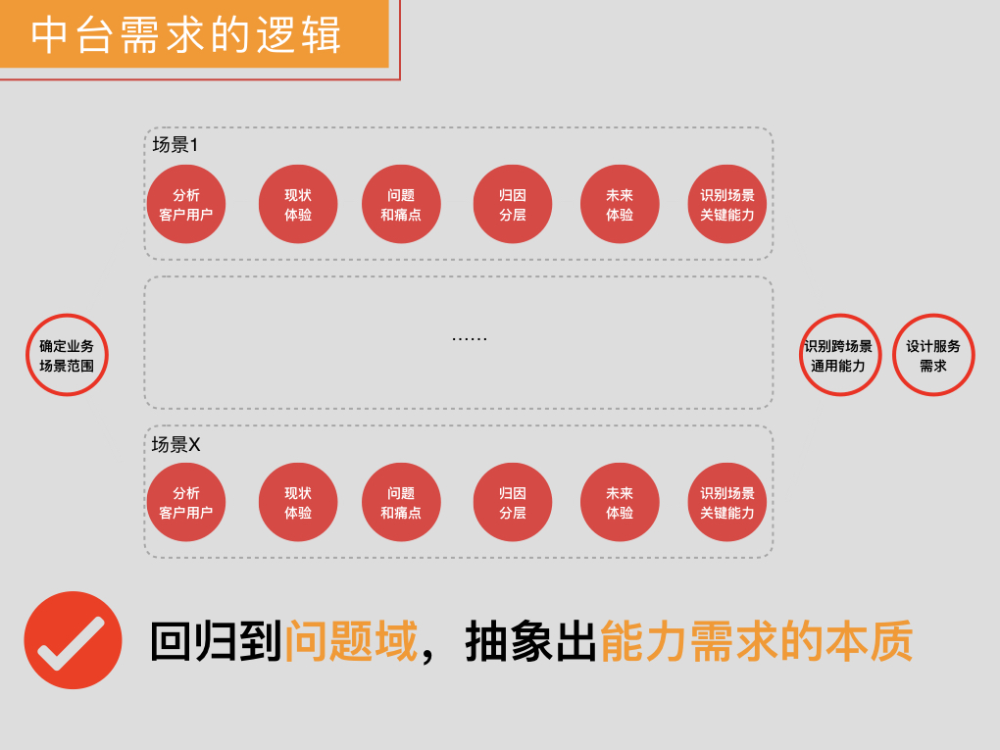
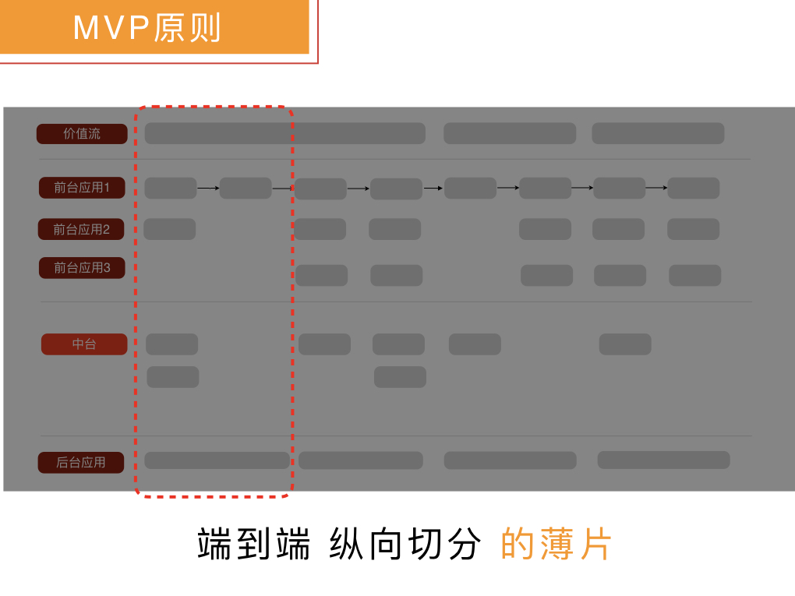
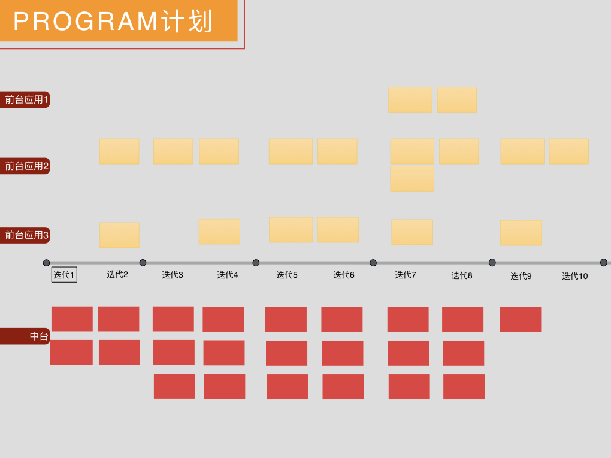
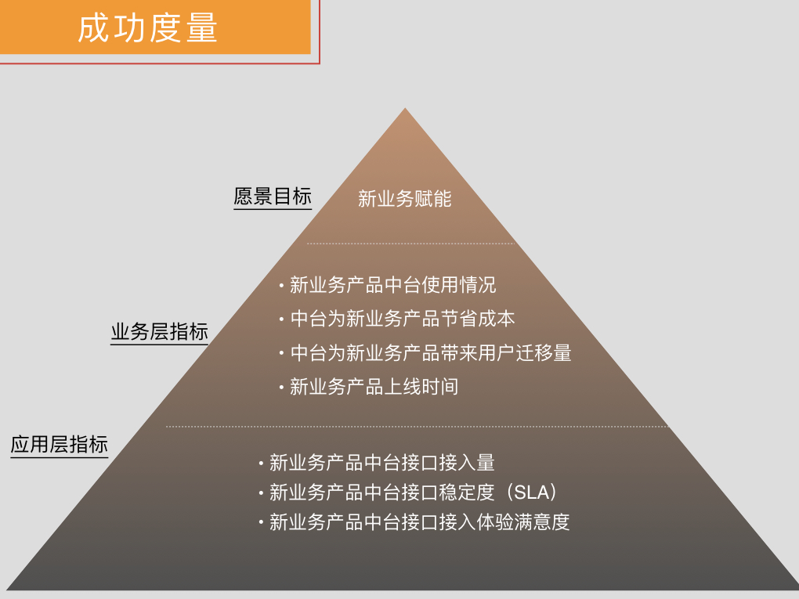

# 中台落地第三步：中台的规划与设计 Design

前两讲我们通过 Discovery 结合 Define，完成了 D4 模型中的第一轮在企业级别的发散和收敛。我们站在企业的高度，基于企业愿景和内外部环境，通过自上而下的战略分解和自下而上的现状调研，再应用企业架构方法的分析，来确定最终的平台型企业架构，并回答到底要不要建中台、需要哪些种类的中台建设、谁先建、谁后建这些问题。

那从这一讲开始，我们就要进入 D4 模型的第二轮发散和收敛。站在一个中台产品的视角，来看看到底应该怎样对其设计并落地实施，也就是 D4 中的 Design 和 Delivery 的两个阶段。同样，本讲先从 Design 开始，我们以一个业务中台的设计和实施为样本，讲述一下这个阶段的思路和关键点。

好了，这时候还需要借用一下极客地产的例子。

我们假设，经过了第一轮企业级的的调研与架构设计，小王及其团队发现确实迫切需要构建一个极客地产自己的业务中台，来实现企业 2022 年的战略目标，也就是 **从重资产业务为主向轻资产的服务业务为主转型，更好地为极客地产的用户群体，即 IT 从业人员提供多场景服务**。

那下一个问题就来了，这个业务中台该如何构建呢？业务中台的搭建又需要从何开始呢？

这节课我们就一起探讨下中台部分的具体设计和启动问题。在当前的这个例子，就是对于极客地产的业务中台（后续简称极客中台）的设计过程。

在设计阶段，我们需要回答的问题就是极客中台的愿景是什么？包含哪些内容？从哪儿开始落地？完成设计阶段，应该就能清晰地知道如何开始进行中台建设，可以让团队开始中台 MVP 的开发工作了。如果对于什么是 MVP 不太清楚，不用担心，后续会介绍到。

## 确定中台产品愿景

讲到现在，你肯定知道了，第一步还是要先搞清楚这个业务中台的愿景和目标，因为这是我们整个中台建设过程的基础，也是中台建设的初心。

还记得我们之前提到过的么，中台的建设就是一条布满荆棘之路，充满曲折。在过程中我们会遇到各种各样的问题与选择。而一个好的中台愿景能让我们始终保持初心，不轻易迷失方向。

那如何来为中台制定一个好的愿景呢？我一般到一个企业去做中台相关的咨询时，我问对方中台建设负责人的第一个问题都是：你们说要做中台，那中台建设的愿景是什么？

我得到的大多数都是肯定的回答，毕竟没有谁会承认自己的项目连个目标和愿景都没有。但是一旦追问到愿景具体是什么的时候，一般就会开始一段漫长的讲述，从公司的历史到现状、从行业聊到企业管理层最近的讲话，总之我总结下来就是：**领导说要做中台，我们做就是了**。

我认为这样是比较危险的。毕竟我们前面提到过，中台的愿景作为所有问题的出发点，需要足够简单明确，才能做到像一个指南针一样，成为我们中台建设过程中指引方向的工具，也才能做到前面提到过的 「遇事不决看愿景」。

这里推荐给你一个简单好用的工具，我们经常用这个工具来帮我们发散和收敛产品的愿景，当然对于中台也是同样适用的，就是 **电梯演讲**（Elevator Pitch）。

顾名思义，电梯演讲假设的场景，就是我们在电梯上偶遇公司管理层，能否在有限的时间内给对方讲清楚我们在做的事情，比如中台。这就要求我们做到足够的收敛。因此电梯演讲的形式，主要是限定了几个产品最关键因素，比如用户是谁，解决什么问题，差异化特点是什么等等。其中每一个要素都非常重要，如果你回答不出来，或是团队的回答不一样，就在一定程度上体现出大家对于中台建设的愿景还没有达成一致，也就为后续各种问题的出现埋下了祸根。

你不要小看这么一个小小的电梯演讲，感觉只要回答几个问题就可以了。从我实际的经验来看，每次规划中台产品愿景的讨论都会超时，一开始觉得可能这么简单的事情，一个小时就能搞定了，后来因为讨论过于激烈，时间拓展到半天时间，到现在我们一般都会预留半天甚至是一整天的时间，来做中台产品愿景的充分发散和收敛。

但即使我们花了这么多的时间，我仍然认为这是十分有必要的。在愿景的讨论上花再多的时间也是值得的，因为这会影响我们中台设计与建设的后续走向，一旦形成，也就会成为我们中台建设的基础，这一步的重要性怎么渲染也不为过。

这里有一个问题，还是要提一下，**愿景的价值和难点就在于充分收敛** 。但我见过很多企业的愿景虽然也用了电梯演讲的方式，但是结果满满地铺了一面墙，看着虽然震撼，但是其实效果是大打折扣的，毕竟我们也没法在一个电梯时间复述完一整面墙的内容。还是那句话，做加法易，做减法难。

## 确定业务梳理范围

中台产品的愿景确定后，下一步就需要进行细粒度的业务架构梳理，抽取共性，识别中台产品的具体需求了。

但是，同样是企业级的原因，此时我们面对的问题往往就是不知道该从哪里下手。毕竟中台有企业级属性，就算是业务梳理也会涉及到企业的全业务线，而且是端到端全流程的梳理工作，工作量之大也往往让人望而却步。

是不是所有的业务线都要梳理？是不是端到端的所有阶段都要梳理？业务梳理要到什么样的粒度？这些都是经常面对的问题。

一般到这里，不同企业的情况就不一样了。如果公司整体规模不是特别大，其实做全业务端到端的业务梳理也是可以的，而这样的好处也是比较全面不容易出现遗漏，对于企业的业务现状能有一个整体的全貌，识别的中台共性需求也会比较准确。

但是很多企业，尤其是中台诉求最高的往往是一些多业务线的大型集团型企业。对于这种规模的企业，做全业务的端到端梳理基本上是不可能的，要不然仅仅是协调人员就是一个麻烦的问题。这时候我们就需要先确定一个范围，再在这个范围内进行业务的梳理和展开。

那这个范围该如何划定呢？还是那句，遇事不决看愿景，这时候我们前面讨论的中台愿景就有用武之地了。

还用极客地产为例，中台建设的愿景是希望通过将成熟业务的能力进行沉淀，并复用到其他新型的轻资产业务线例如长租公寓业务中，通过能力的复用快速实现业务的轻量化转型（具体的电梯演讲这里就不展开了）。

而目前的情况是，极客地产专注于服务 IT 群体，地产和物业业务发展成熟，有了非常健全的 IT 基础设施。现在针对这一人群挖掘出了很强的长租公寓需求，但是长租公寓作为新的业务线，无论是从投资拓展、设计、招标采购、工程建设、装修改造、客户管理到物业运营等等，这些方面都是从零开始。

回到业务梳理范围的问题上，有了清晰的愿景，就可以让我们的业务梳理更加聚焦。

首先从业务线上来看，就不一定所有的业务线都需要梳理。还是看极客地产这个例子，旗下涉猎广泛，还有业务线专注在投资、文化和教育等方面，因为这些业务线都是长期独立发展，与前面提到的极客地产中台产品的愿景目标也没有太大的直接关系，所以可以先直接跳过。

然后就是从端到端的业务价值链上。通过分析，由于企业的战略是轻资产服务化，所以对于像地产行业的工程建设，也就是盖楼盖房的部分，与企业基于轻资产战略投注的新业务都不适用，所以也不需要再进行梳理。

至此，基于中台的建设愿景，我们就可以在横向端到端价值链和纵向的业务线上收敛到一个聚焦的区域。

再在这个聚焦的区域中进行业务梳理和展开，就会更加有效率和聚焦。

## 细粒度业务梳理

在确定了梳理范围之后，接下来就是具体的业务梳理工作了。

一般大家的做法都是基于现有的流程或系统，对现有业务的流程进行梳理，例如在电子商务领域大家经常提到的四流，具体指的是 **信息流、商流、资金流、物流** 的梳理工作，使用的工具也大多是 **流程图** 这种非常成熟的工具。

但是这种基于已有流程的梳理有时候会有一些限制，简单讲就是可能会基于过去遗留的业务债推导出伪中台需求。什么意思呢？就是对于一些长期且成熟的业务，现有的业务方式可能并不是一个最好的方式，而是由于长时间发展以及和过去的各种周边限制以及 IT 限制妥协的产物。

举个例子，往往时间比较长的业务线都会有非常复杂的审批审核流程。但是审核和审批流程其实只是一种解决方案，要解决的问题可能是过程造假或是其他的一些内部风险和问题。复杂的审批流程也往往是信息化时代甚至是更早的纸质时代的过程管控的产物，由于信息化更多只是将线下的流程线上化，所以一直延续至今，而且为了高度复刻还原纸质时代的流程，还非常中国特色地出现了各种的奇怪的审批逻辑，例如会签等等。

但是如果我们重新回到问题域，重新思考问题本身，我们就发现可能在当今这个数字化的时代，在大数据和 AI 已经广泛应用的今天，甚至可能不再需要流程审批这样一个过程。通过新的技术，我们可以用实时的审计分析或是风险识别来发现业务过程中的一些异常，甚至通过完全的自动化，消除中间人员参与的环节，从根本上解决这些问题，从而真正发挥数字化的威力。

这种回到问题域本身，回到问题的原点，基于用户需求在当前的业务及技术条件下，重新设计解决方案的思维方法，可以避开上面提到的业务债陷阱，也多用于创新型业务的设计过程，而这种思维方式也大量参考和借鉴了 **设计思维**（Design Thinking）的方法。

所以和基于现状的传统业务流程梳理不同，我们在业务梳理过程中大量地采用了基于 **设计思维**，结合 **用户体验地图**（User Journey Map）和 **服务蓝图**（Service Map）的方式。回到业务本身，从问题域出发，以用户为中心，进行用户体验设计和业务服务蓝图的梳理，从效果上来看也是非常不错的。

当然不是说哪种方法更好，不同的工具和方法有不同的适用场景和优劣势，如果都能灵活掌握，甚至可以结合使用，充分发挥出各自的优势。

通过范围内的业务架构梳理，再结合最后的跨场景通用能力的分析，我们就可以对关注领域的业务全貌有了一定深入的了解，并且可以 **识别出不同业务线中一些可复用的业务数据、业务功能与业务流程**。而这些通用的业务数据、业务功能、业务流程经过加工分析就形成了中台的具体需求。对于这些需求，我们是通过 **用户故事**（User Story）的方式描述的。

## 确定 MVP

通过业务梳理，我们识别和整理了大量的业务中台需求。值得注意的是，此时的所谓中台产品需求，更多的是来源于定性抽象，再考虑到中台的需求往往不像前台业务系统的需求那样明确，所以，从严格意义上来讲，此时的需求仍属于一系列高风险的假设。

从我实际参与的中台建设项目来看，往往这些一开始设想的中台需求，到真正开发完成之后，都与最初的设想有很大的偏差。这就意味着，中台建设的周期越长，需求假设的风险和需要为之付出的代价就越大。

所以，我们在中台的建设过程中，引入了精益创业中的 **MVP 原则**（Minimum Viable Product，最小可用品），也实现了我之前提到的整体原则中的 Start Small。

为了实现 MVP，保证做出来的 MVP 可用，我们在业务需求上采用 **端到端纵向切分的方式**，结合需求优先级的多维度评分排序，最终确定 MVP 的需求范围，而最终落地的形式可能就是第一个迭代的用户故事列表。

那已经有了具体的用户故事列表，是不是我们就可以开始着手开发了呢。先别急，有两个事情，我们建议在开始中台建设之前就需要考虑，那就是运营计划和度量指标。

## 运营前置：制定迭代计划及接入计划

首先我们来看看运营计划。对于中台可能就是中台产品推广、前台（用户）接入计划以及接入后的运营支持。

我过去看到的情况是，中台建设的中后期才开始考虑这些问题，往往就有些晚了。而且很多情况下，前台是不会停下来等中台建设完，等接入后再开始自己的业务演进，所以往往都是前中台并行。

这个过程就很像是我们开发中的分支开发一样，修改的又是同一块内容，所以当合并的时候就会非常痛苦。

所以提前考量运营计划尤其是接入计划，尽量使用合理的接入计划（我看到有很多企业把这个接入计划叫作上车计划，非常形象）来规避一些风险，对于中台产品的建设也非常关键。具体的运营策略，在下一篇中讲为你展开介绍。

## 度量前置：定义验证指标

另一个需要在中台产品建设开始之前就要想清楚的就是度量指标。这一点，不知道你是否还记得，我们在之前讲中台建设前需要想清楚的四个问题时，已经讲到过了。具体为什么需要将度量指标设计前置到开发之前，之前已经阐述过了，在这里我就为你分享一些度量指标的设计思路。

首先，我们先来看看一般我们常用的有哪些指标。我把市面上最常见到的产品度量指标，分为了四个大类，也就是**战略类、用户类、市场拓展类与降本提效类**。基于每一个维度展开，都能找到很多的常用度量指标。

而对于中台来讲，难就难在与市场和用户之间还隔着一层前台，所以在度量上就不如直接接触用户的前台系统这么清晰。但是我们讲中台是为前台业务赋能的，又不能脱离开业务，单纯只在技术上做一些度量，例如接口稳定性和接口数量等，这样也不符合中台对于业务支撑赋能的定位和价值。

所以我们一般在考虑中台的度量指标的时候，还是把战略价值和业务价值作为出发点，开始拆解和推导，并且按照干系人关注点的不同，用多维度、多层次的指标设计来审视中台建设的效果。这里要强调一下，虽然维度和视角不同，我们要保证所有指标体现的中台建设目标必须是一个。

而具体到实施方法，因为每一个中台产品都是不一样的，所以很难给一个标准的答案。在实操过程中，建议你多换位思考，多问几个「怎么（How）」。相信你比较熟悉 5Why 分析法，这里我们可以稍微改一下，用 **5How** 来驱动验证指标的设计。

举个例子，如果我站公司管理层的视角：

- 那我怎么判断中台建设的成果？如果回答是看对于新业务的赋能，
- 那我怎么验证对于新业务的赋能效果？如果回答是看新业务的上线速度，
- 那我怎么验证新业务的上线速度？如果回答是看新业务从立项到上线的时间，
- 那我怎么验证……

你看，大家经常会说度量比较难，其实每个人心里都有一杆秤，只不过我们没有把这个秤清晰地表达出来。通过  5How，我们可以不断追问，将每个人心中的这杆秤发掘出来，来更好地指导我们中台产品的建设和推进。

## 总结思考

本节课以一个业务中台的建设过程为例，以业务中台的愿景作为切入点，介绍了电梯演讲的工具，再基于中台建设愿景，明确业务梳理的范围和优先级。

明确了业务梳理的切入点和范围之后，我们就可以基于设计思维进行以用户为中心的业务流程梳理和服务设计了，再结合领域驱动设计进行业务模型梳理，最终再通过跨业务线的综合分析，识别共性业务数据、业务流程、业务模式的中台需求。

之后通过引入精益创业中的 MVP 原则，对于中台需求基于业务优先级采用端到端纵向切分的方式，最终确定中台建设的启动点，也就是第一阶段的具体建设内容。

最后有了中台产品运营机制和度量指标的分析与设计之后，我们就可以正式地立项并进入到交付阶段具体实施了。

那下一讲我我们就正式进入到 D4 的最后一个阶段，也就是 Delivery 的交付阶段，看看我们在交付阶段使用的思路和方法，以及要注意的问题。

最后给你留几个思考题：

- 你们的业务梳理过程是怎么样的？中台需求是怎么分析出来的？
- 你们采用了 MVP 原则了吗？是如何规避中台建设的需求假设风险的？