# 03丨分组与引用：如何用正则实现更复杂的查找和替换操作？

今天我打算和你聊聊分组与引用。那什么场合下会用到分组呢？

假设我们现在要去查找 15 位或 18 位数字。根据前面学习的知识，使用量词可以表示出现次数，使用管道符号可以表示多个选择，你应该很快就能写出 `\d{15}|\d{18}`。但经过测试，你会发现，这个正则并不能很好地完成任务，因为 18 位数字也会匹配上前 15 位，具体如下图所示。

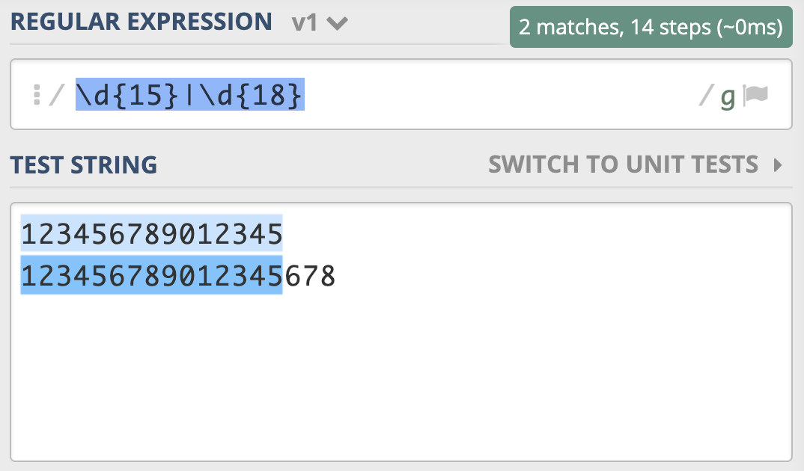

为了解决这个问题，你灵机一动，很快就想到了办法，就是把 15 和 18 调换顺序，即写成  `\d{18}|\d{15}`。你发现，这回符合要求了。

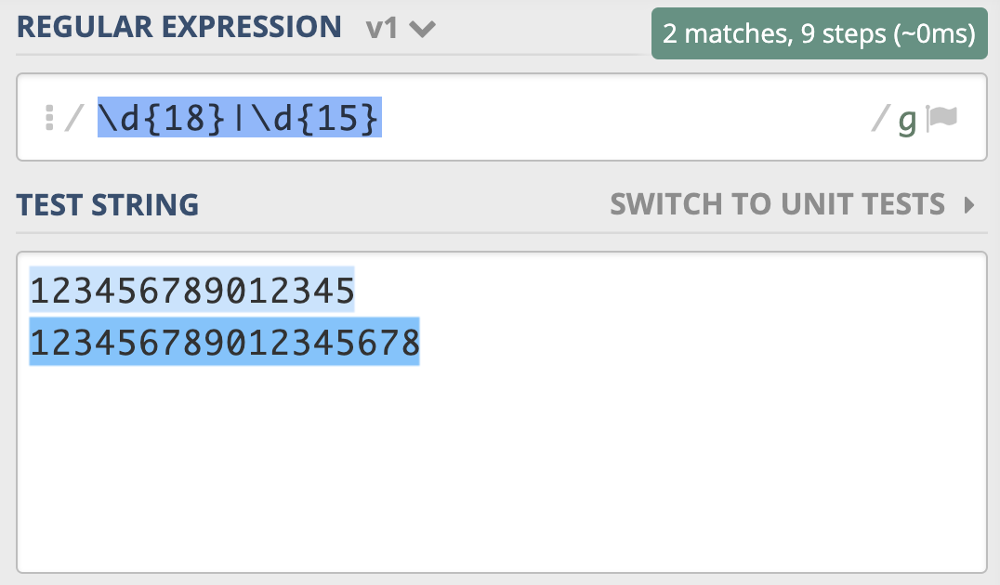

上述测试文本为：

```
123456789012345
123456789012345678
```

使用 `\d{15,18}` 也可以实现要求。


为什么会出现这种情况呢？**因为在大多数正则实现中，多分支选择都是左边的优先**。

类似地，你可以使用 `北京市|北京` 来查找 「北京」 和 「北京市」。另外我们前面学习过，问号可以表示出现 0 次或 1 次，你发现可以使用 `北京市?` 来实现来查找「北京」 和 「北京市」

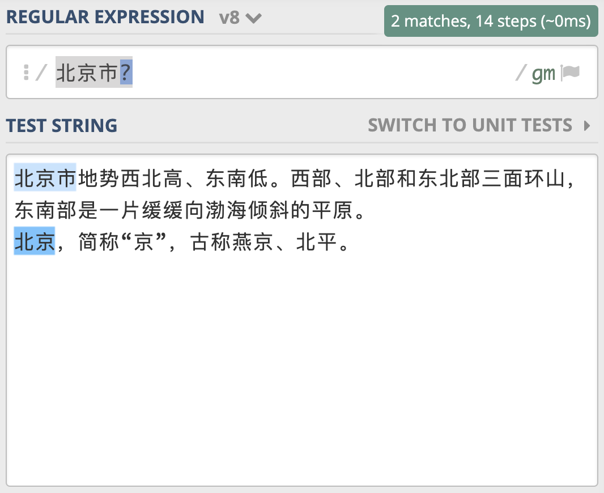

测试文本为：

```
北京市，简称“京”，古称燕京、北平
北京有长城
```

同样，针对 15 或 18 位数字这个问题，可以看成是 15 位数字，后面 3 位数据有或者没有，你应该很快写出了 `\d{15}\d{3}?` 。但这样写对不对呢？我们来看一下。

在上一节我们学习了量词后面加问号表示非贪婪，而我们现在想要的是 `\d{3}` 出现 0 次或 1 次。

- 示例一：

  `\d{15}\d{3}?`   由于  `\d{3}`  表示三次，加问号非贪婪还是 3 次

- 示例二：

  `\d{15}(\d{3})?` 在 `\d{3}` 整体后加问号，表示后面三位有或无

这时候，必须使用 **括号** 将来把表示 **三个数字** 的 `\d{3}` 这一部分括起来，也就是表示成 `\d{15}(\d{3})?` 这样。现在就比较清楚了：**括号在正则中的功能就是用于分组**。简单来理解就是，由多个元字符组成某个部分，应该被看成一个整体的时候，可以用括号括起来表示一个整体，这是括号的一个重要功能。其实用括号括起来还有另外一个作用，那就是 **复用**，我接下来会给你讲讲这个作用。

## 分组与编号

括号在正则中可以 **用于分组**，被括号括起来的部分 「子表达式」会被保存成一个 **子组**。

那分组和编号的规则是怎样的呢？其实很简单，用一句话来说就是，第几个括号就是第几个分组。这么说可能不好理解，我们来举一个例子看一下。

这里有个时间格式 2020-05-10 20:23:05。假设我们想要使用正则提取出里面的日期和时间。


我们可以写出如图所示的正则，将日期和时间都括号括起来。这个正则中一共有两个分组，日期是第 1 个，时间是第 2 个。

### 不保存子组

**在括号里面的会保存成子组**，但有些情况下，你可能只想用括号将某些部分看成一个整体，**后续不用再用它**，类似这种情况，在实际使用时，是没必要保存子组的。这时我们可以在括号里面使用 `?:`  不保存子组。

如果正则中出现了括号，那么我们就认为，**这个子表达式在后续可能会再次被引用**，所以 **不保存子组可以提高正则的性能**。除此之外呢，这么做还有一些好处，由于子组变少了，正则性能会更好，在 **子组计数时也更不容易出错**。

那到底啥是不保存子组呢？我们可以理解成，**括号只用于归组，把某个部分当成「单个元素」，不分配编号，后面不会再进行这部分的引用**。


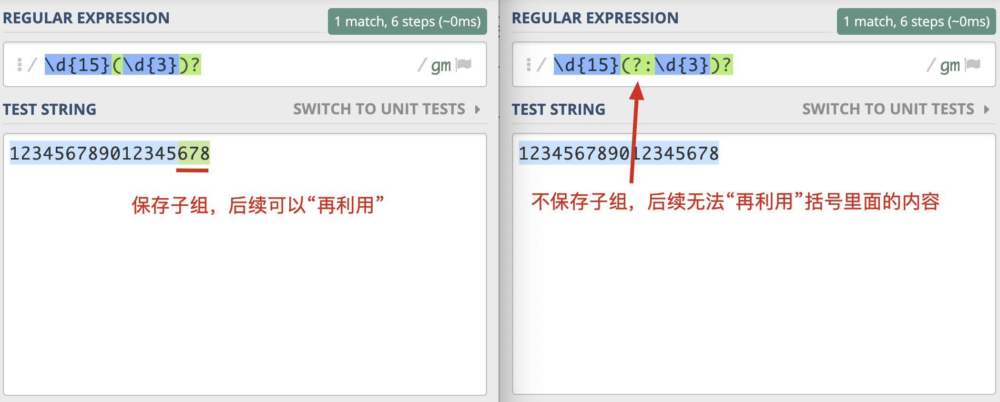

### 括号嵌套

前面讲完了子组和编号，但有些情况会比较复杂，比如在括号嵌套的情况里，我们要看某个括号里面的内容是第几个分组怎么办？不要担心，其实方法很简单，我们只需要数左括号（开括号）是第几个，就可以确定是第几个子组。

在阿里云简单日志系统中，我们可以使用正则来匹配一行日志的行首。假设时间格式是 2020-05-10 20:23:05 。


日期分组编号是 1，时间分组编号是 5，年月日对应的分组编号分别是 2，3，4，时分秒的分组编号分别是 6，7，8。

### 命名分组

前面我们讲了分组编号，但由于编号得数在第几个位置，后续如果发现正则有问题，改动了括号的个数，还 **可能导致编号发生变化**，因此一些编程语言提供了 **命名分组（named grouping）**，这样和数字相比更容易辨识，不容易出错。命名分组的格式为 `(?P<分组名>正则)`。

比如在 Django 的路由中，命名分组示例如下：

```
url(r'^profile/(?P<username>\w+)/$', view_func)
```

需要注意的是，刚刚提到的方式命名分组和前面一样，给这个分组分配一个编号，不过你可以使用名称，不用编号，实际上命名分组的编号已经分配好了。不过命名分组并不是所有语言都支持的，在使用时，你需要查阅所用语言正则说明文档，如果支持，那你才可以使用。

## 分组引用

在知道了分组引用的编号 （number）后，大部分情况下，我们就可以使用 `反斜扛 + 编号`，即  `\number`  的方式来进行引用，而 JavaScript 中是通过 `$编号` 来引用，如 `$1`。

我给到了你一些在常见的编程语言中，分组查找和替换的引用方式：

|  变成语言  |  查找时引用方式   |  替换时引用方式   |
| :--------: | :---------------: | :---------------: |
|   Python   | `\number` 如 `\1` | `\number` 如 `\1` |
|     Go     |    官方不支持     |    官方不支持     |
|    Java    | `\number` 如 `\1` | `$number` 如 `$1` |
| JavaScript | `$number` 如 `$1` | `$number` 如 `$1` |
|    PHP     | `\number` 如 `\1` | `\number` 如 `\1` |
|    Ruby    | `\number` 如 `\1` | `\number` 如 `\1` |

这些内容不要求你完全记住，只要有个印象就好，最关键的是要知道正则可以实现这样的功能，

需要用到的时候查一下相应的文档，就知道怎么用了。

## 分组引用在查找中使用

前面介绍了子组和引用的基本知识，现在我们来看下在 **正则查找时如何使用分组引用**。比如我们要找重复出现的单词，我们使用正则可以很方便地使「前面出现的单词再次出现」，具体要怎么操作呢？我们可以使用  `\w+`  来表示一个单词，针对刚刚的问题，我们就可以很容易写出 `(\w+) \1`  这个正则表达式了。

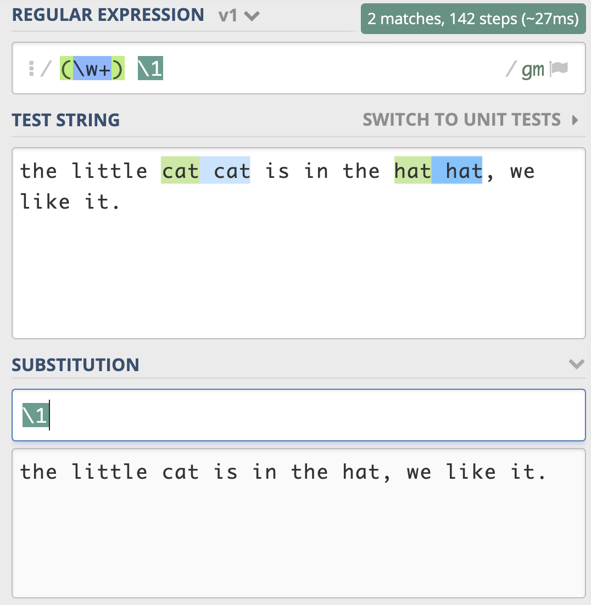

练习文本为

```
the little cat cat is in the hat hat,we like it
```

## 分组引用在替换中使用

和查找类似，我们可以使用 **反向引用**，在得到的结果中，去拼出来我们想要的结果。还是使用刚刚日期时间的例子，我们可以很方便地将它替换成， 2020 年 05 月 10 日这样的格式。

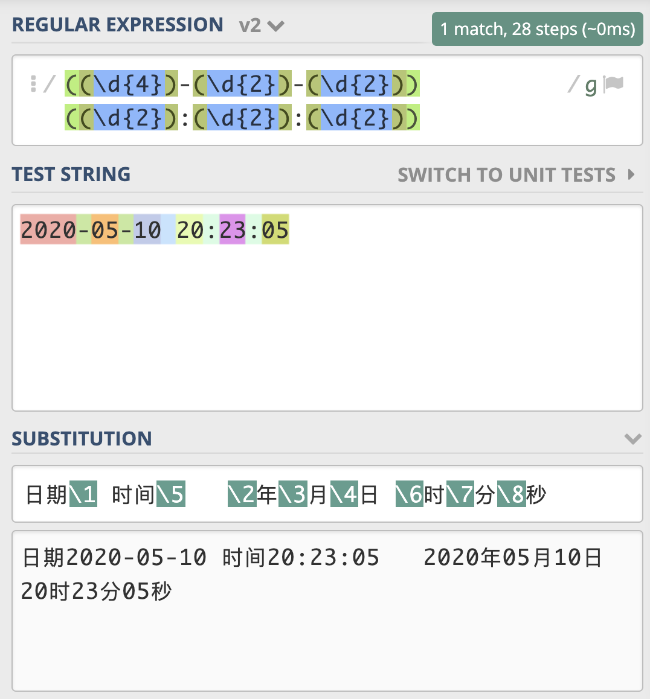

练习文本为

```
2020-05-10 20:23:05
```

表达式与应用

```
(\d{4})-(\d{2})-(\d{2}) (\d{2}):(\d{2}):(\d{2})

\1 年 \2 月 \3 日 \4 时 \5 分 \6 秒

这里和图上的不完全一样，自己尝试去练习的
```

练习示例：https://regex101.com/r/2RVPTJ/2。

不知道学到这里，你有没有觉得子组和引用非常强大呢？

你可能很好奇，那在编程语言中如何实现这个功能呢？我下面以 Python3 为例，给出一个示例。

```python
>>> import re
>>> test_str = "2020-05-10 20:23:05"
>>> regex = r"((\d{4})-(\d{2})-(\d{2})) ((\d{2}):(\d{2}):(\d{2}))"
>>> subst = r"日期\1 时间\5   \2年\3月\4日 \6时\7分\8秒"
>>> re.sub(regex, subst, test_str)
'日期2020-05-10 时间20:23:05   2020年05月10日 20时23分05秒'
```

## 在文本编辑器中使用

### Sublime Text 3 简介

接下来我用 Sublime Text 3 来当例子，给你讲解一下正则查找和替换的使用方式。Sublime Text 3 是一个跨平台编辑器，非常小巧、强悍，虽然是一个收费软件，但可以永久试用，你自行可以下载安装。

当熟练使用编辑器之后，你会发现在很多工作里都可以使用它，不需要编写代码就可以完成。

下面我以文本编辑器 Sublime Text 3 为例，来讲解正则查找和替换的使用方式。首先，我们要使用的「查找」或「替换」功能，在菜单 Find 中可以找到。


下面是对编辑器查找 - 替换界面的图标简介，Find 输入栏第一个 `.*`  图标，表示开启或关闭正则支持。

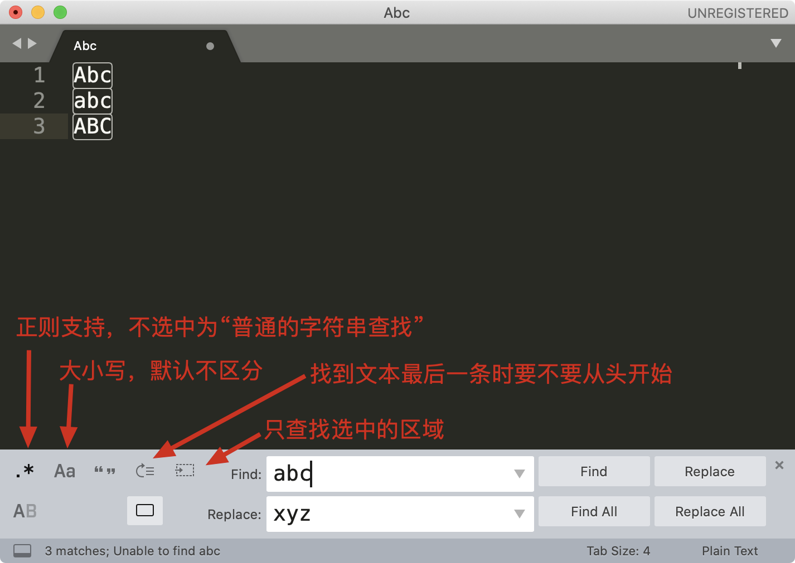

### 编辑器中进行正则查找

接下来，我们来演示用编辑器查找引号引起来的内容，课程中使用到的文本，建议你用 chrome 等浏览器等，打开极客时间网页版本 https://time.geekbang.org，点击右键查看源代码，把看到的代码复制到 Sublime Text 3 中。

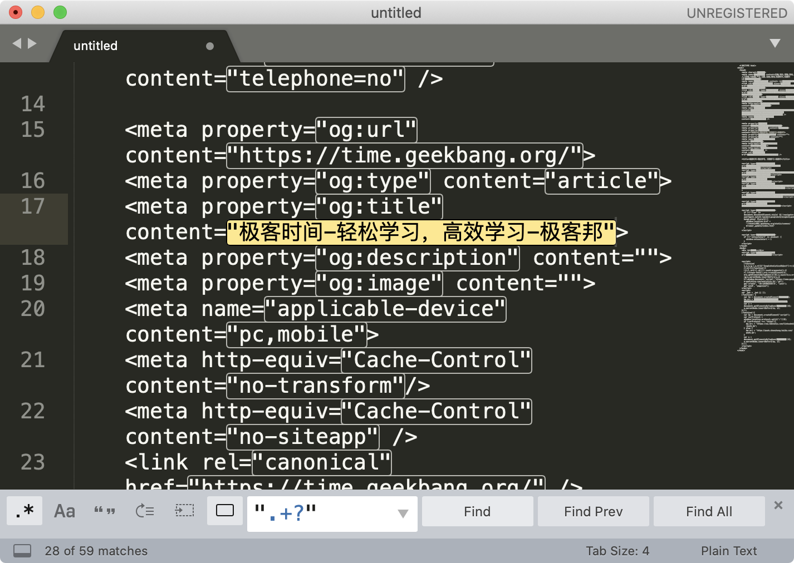

输入相应的正则，我们就可以看到查找的效果了。这里给一个小提示，如果你点击 Find All，然后进行剪切，具体操作可以在菜单中找到 `Edit -> Cut`，也可以使用快捷键操作。剪切之后，找一个空白的地方，粘贴就可以看到提取出的所有内容了。

我们可以使用正则进行资源链接提取，比如从一个图片网站的源代码中查找到图片链接，然后再使用下载工具批量下载这些图片。

### 在编辑器中进行正则替换

接着，我们再来看一下在编辑器中进行文本替换工作。你可以在编辑器中输入这些文本：

```
the little cat cat is in the hat hat, we like it.
```

如果我们要尝试从中查找连续重复出现两次的单词，我们可以用 \w+ 代表单词，利用我们刚刚学习的知识，相信你可以很快写出正则  `(\w+) \1`。

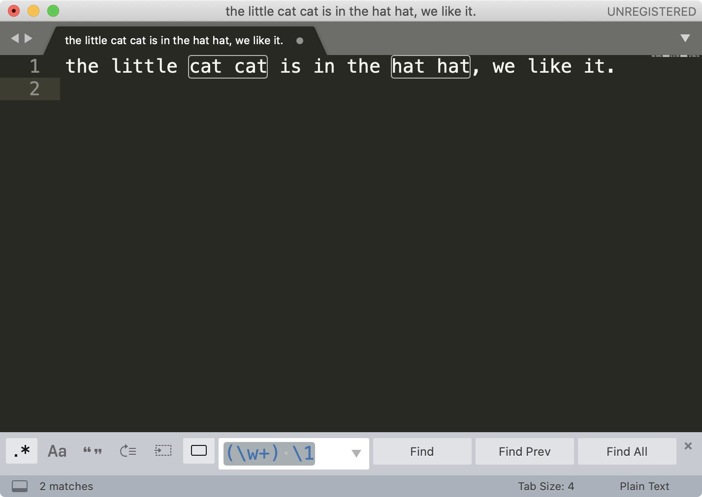

接着点击菜单中的 `Find -> Replace`，在替换栏中输入子组的引用  `\1` ，然后点击 Replace All 就可以完成替换工作了。

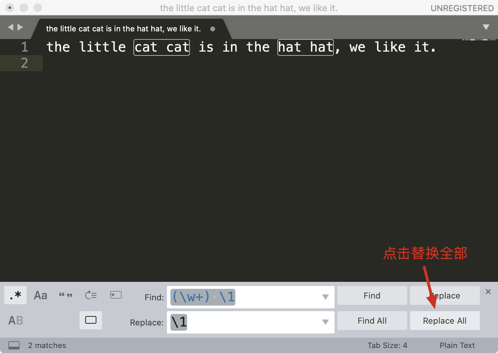

这样，通过少量的正则，我们就完成了文本的处理工作了。

几乎所有主流编辑器都是支持正则的，你可以在你喜欢的编辑器中尝试一下这个例子，在后面的工作中，也可以尝试使用它来完成一些复杂的文本查找和替换工作。

## 总结

好了，今天的内容讲完了，我来带你总结回顾一下。

今天我们学习到了正则中的分组和子组编号相关内容。括号可以将某部分括起来，看成一个整体，也可以保存成一个子组，在后续查找替换的时候使用。分组编号是指，在正则中第几个括号内就是第几个分组，而嵌套括号我们只要看左括号是第几个就可以了。如果不想将括号里面的内容保存成子组，可以在括号里面加上 `?:`  来解决。

搞懂了分组的内容，我们就可以利用分组引用，来实现将「原文本部分内容」，在查找或替换时进行再次利用，达到实现复杂文本的查找和替换工作。甚至在使用一些文本编辑器的时候，不写代码，我们就可以完成文本的查找替换处理工作，这往往可以节约很多开发时间。

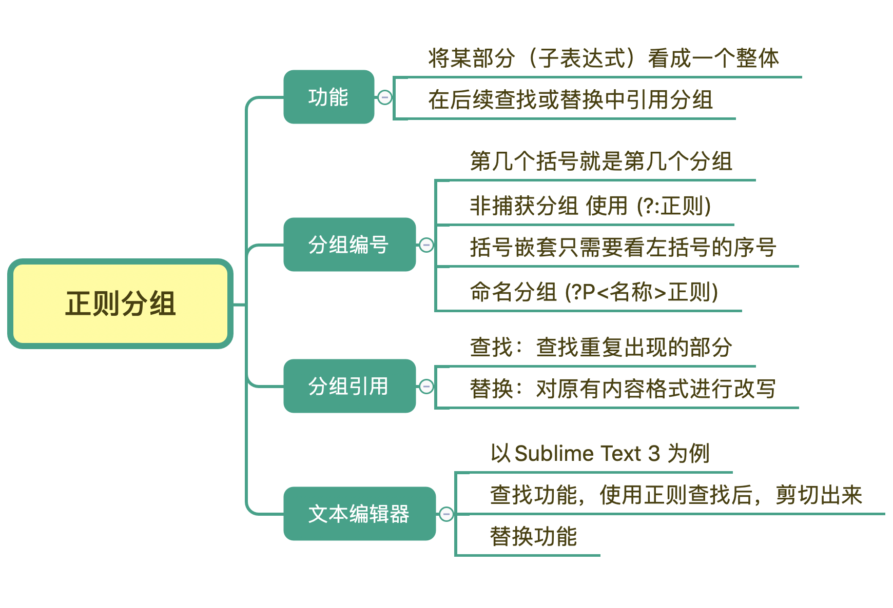

## 课后思考

有一篇英文文章，里面有一些单词连续出现了多次，我们认为连续出现多次的单词应该是一次，比如：

```
the little cat cat is in the hat hat hat, we like it.
```

其中 cat 和 hat 连接出现多次，要求处理后结果是

```
the little cat is in the hat, we like it.
```


这个题目我给出了相应的地址 https://regex101.com/r/2RVPTJ/3，你可以直接在网页上进行测试，写入相应的 「正则查找部分」 和 「正则替换部分」，让结果符合预期。多动手练习，你才能更好地掌握学习的内容。

练习文本为

```
the little cat cat is in the hat hat hat, we like it.
```

答案为

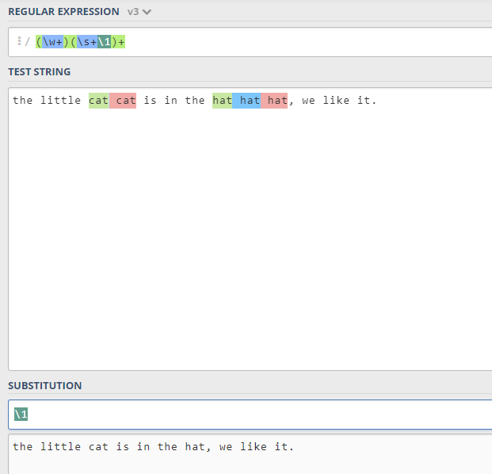

```
正则部分： (\w+)((\s+)+\1)+   这个更精简  (\w+)(\s+\1)+
正则替换部分：\1
```

解释：

正则部分：

- `\w+`：匹配每个单词，默认是贪婪模式，可以匹配到每个单词

  因为单词中间是用空格分割的，而 `\w` 中不包含空格

- `\s+` 匹配的是 1 到 多个空格，hat 前面最多是有 2 个空格的

- `\1` 应用了 `(\w+)`, 来组成重复的效果

- `(\s+\1)+`：另外用了括号嵌套，将任意空格和重复单词，看成是一个整体，可以出现 1 到多次

替换部分： `\1` 引用的是 `(\w+)` 这组，不包含空格的单词。笔者这里不太理解直接使用引用，怎么就显示全文了？