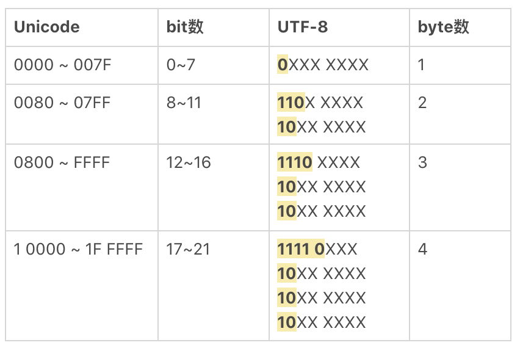
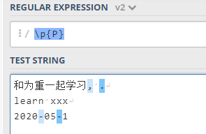
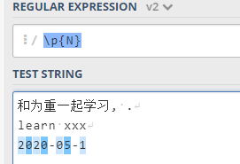
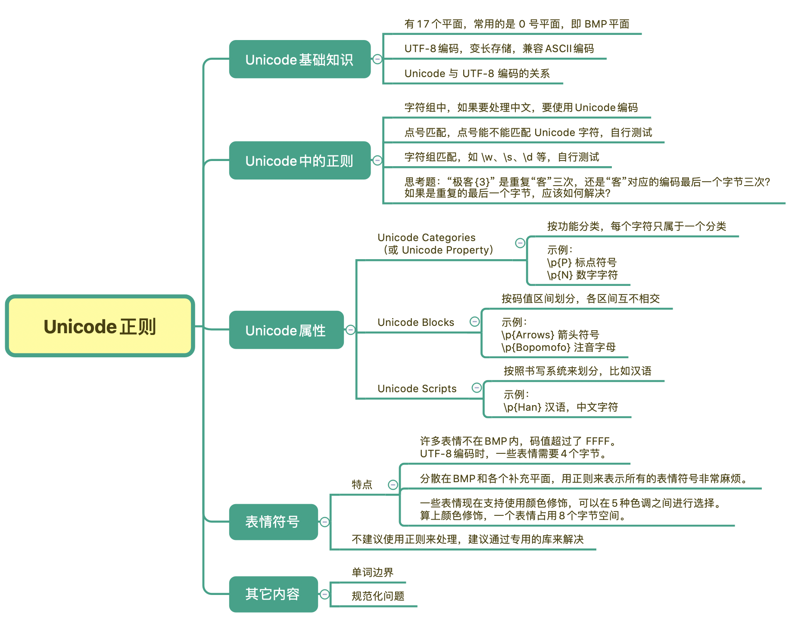

# 08丨应用 1：正则如何处理 Unicode 编码的文本？

如何使用正则来处理 Unicode 编码的文本。如果你需要使用正则处理中文，可以好好了解一下这些内容。

不过，在讲解正则之前，我会先给你讲解一些基础知识。只有搞懂了基础知识，我们才能更好地理解今天的内容。一起来看看吧！

## Unicode 基础知识

**Unicode**（中文：万国码、国际码、统一码、单一码）是计算机科学领域里的一项业界标准。它对世界上大部分的文字进行了整理、编码。Unicode 使计算机呈现和处理文字变得简单。

Unicode 至今仍在不断增修，每个新版本都加入更多新的字符。目前 Unicode 最新的版本为 2020 年 3 月 10 日公布的 13.0.0，已经收录超过 14 万个字符。

现在的 Unicode 字符分为 17 组编排，**每组为一个平面（Plane）**，而 **每个平面拥有 65536（即 2 的 16 次方）个码值（Code Point）**。然而，目前 Unicode 只用了少数平面，我们用到的绝大多数字符都属于第 0 号平面，即 **BMP 平面**。除了 BMP 平面之外，其它的平面都被称为 **补充平面**。

关于各个平面的介绍我在下面给你列了一个表，你可以看一下。


Unicode 标准也在不断发展和完善。目前，**使用 4 个字节的编码表示一个字符**，就可以表示出全世界所有的字符。那么 Unicode 在计算机中如何存储和传输的呢？这就涉及编码的知识了。

**Unicode 相当于规定了字符对应的码值**，这个码值需要 **编码成字节的形式去传输和存储**。最常见的 **编码方式是 UTF-8**，另外还有 UTF-16，UTF-32 等。UTF-8 之所以能够流行起来，是因为其编码比较巧妙，**采用的是变长的方法。也就是一个 Unicode 字符，在使用 UTF-8 编码表示时占用 1 到 4 个字节不等**。最重要的是 Unicode 兼容 ASCII 编码，在表示纯英文时，并不会占用更多存储空间。**而汉字呢，在 UTF-8 中，通常是用三个字节来表示**。

```python
>>> u'正'.encode('utf-8')
b'\xe6\xad\xa3'
>>> u'则'.encode('utf-8')
b'\xe5\x88\x99'
```

下面是 Unicode 和 UTF-8 的转换规则，你可以参考一下。



## Unicode 中的正则

在你大概了解了 Unicode 的基础知识后，接下来我来给你讲讲，在用 Unicode 中可能会遇到的坑，以及其中的点号匹配和字符组匹配的问题。

### 编码问题的坑

如果你在编程语言中使用正则，编码问题可能会让正则的匹配行为很奇怪。先说结论，**在使用时一定尽可能地使用 Unicode 编码**。

如果你需要在 Python 语言中使用正则，我建议你使用 Python3。如果你不得不使用 Python2，一定要记得使用 Unicode 编码。在 Python2 中，一般是以 u 开头来表示 Unicode。如果不加 u，会导致匹配出现问题。比如我们在「极客」这个文本中查找「时间」。你可能会很惊讶，竟然能匹配到内容。

下面是 Python 语言示例：

```python
# 测试环境 macOS/Linux/Windows， Python2.7
>>> import re
>>> re.search(r'[时间]', '极客') is not None
True
>>> re.findall(r'[时间]', '极客')
['\xe6']
# Windows下输出是 ['\xbc']
```

通过分析原因，我们可以发现，不使用 Unicode 编码时，正则会被编译成其它编码表示形式。比如，在 macOS 或 Linux 下，一般会编码成 UTF-8，而在 Windows 下一般会编码成 GBK。

下面是我在 macOS 上做的测试，「时间」这两个汉字表示成了 UTF-8 编码，正则不知道要每三个字节看成一组，而是把它们当成了 6 个单字符。

```python
# 测试环境 macOS/Linux，Python 2.7
>>> import re
>>> re.compile(r'[时间]', re.DEBUG)
in
  literal 230
  literal 151
  literal 182
  literal 233
  literal 151
  literal 180
<_sre.SRE_Pattern object at 0x1053e09f0>
>>> re.compile(ur'[时间]', re.DEBUG)
in
  literal 26102
  literal 38388
<_sre.SRE_Pattern object at 0x1053f8710>
```

我们再看一下 极客 和 时间 这两个词语对应的 UTF-8 编码。你可以发现，这两个词语都含有 16 进制表示的 e6，而 GBK 编码时都含有 16 进制的 bc，所以才会出现前面的表现。

下面是查看文本编码成 UTF-8 或 GBK 方式，以及编码的结果：

```python
# UTF-8
>>> u'极客'.encode('utf-8')
'\xe6\x9e\x81\xe5\xae\xa2'  # 含有 e6
>>> u'时间'.encode('utf-8')
'\xe6\x97\xb6\xe9\x97\xb4'  # 含有 e6
# GBK
>>> u'极客'.encode('gbk')
'\xbc\xab\xbf\xcd'  # 含有 bc
>>> u'时间'.encode('gbk')
'\xca\xb1\xbc\xe4'  # 含有 bc
```

这也是前面我们花时间讲编码基础知识的原因，只有理解了编码的知识，你才能明白这些。在学习其它知识的时候也是一样的思路，不要去死记硬背，搞懂了底层原理，你自然就掌握了。因此在使用时，一定要指定 Unicode 编码，这样就可以正常工作了。

```python
# Python2 或 Python3 都可以
>>> import re
>>> re.search(ur'[时间]', u'极客') is not None
False
>>> re.findall(ur'[时间]', u'极客')
[]
```

### 点号匹配

之前我们学过，**点号 ** 可以匹配除了换行符以外的任何字符，但之前我们接触的大多是单字节字符。在 Unicode 中，点号可以匹配上 Unicode 字符么？这个其实情况比较复杂，不同语言支持的也不太一样，具体的可以通过测试来得到答案。

下面我给出了在 Python 和 JavaScript 测试的结果：

```python
# Python 2.7
>>> import re
>>> re.findall(r'^.$', '学')
[]
>>> re.findall(r'^.$', u'学')
[u'\u5b66']
>>> re.findall(ur'^.$', u'学')
[u'\u5b66']
# Python 3.7
>>> import re
>>> re.findall(r'^.$', '学')
['学']
>>> re.findall(r'(?a)^.$', '学')
['学']
```

```javascript
/* JavaScript(ES6) 环境 */
> /^.$/.test("学")
true
```

至于其它的语言里面能不能用，你可以自己测试一下。在这个课程里，我更多地是希望你掌握这些学习的方法和思路，而不是单纯地记住某个知识点，一旦掌握了方法，之后就会简单多了。

### 字符组匹配

之前我们学习了很多字符组，比如 `\d` 表示数字，`\w` 表示大小写字母、下划线、数字，`\s` 表示空白符号等，那 Unicode 下的数字，比如全角的 1、2、３等，算不算数字呢？全角的空格算不算空白呢？同样，你可以用我刚刚说的方法，来测试一下你所用的语言对这些字符组的支持程度。

### Unicode 属性

在正则中使用 Unicode，还可能会用到 Unicode 的一些属性。这些属性把 Unicode 字符集划分成不同的字符小集合。

在正则中常用的有三种，分别是:

-  按 **功能划分** 的 Unicode Categories（有的也叫 Unicode Property），比如标点符号，数字符号；
- 按 **连续区间划分** 的 Unicode Blocks，比如只是中日韩字符；
- 按 **书写系统划分** 的 Unicode Scripts，比如汉语中文字符。

| 属性                                     | 划分依据                           | 示例                                              | 语言支持                                                     |
| ---------------------------------------- | ---------------------------------- | ------------------------------------------------- | ------------------------------------------------------------ |
| Unicode Categories 或 Unicode Properties | 按功能划分，如数字、标点、空白符等 | `\p{P}` 标点符号<br/>`\p{N}` 数字字符             | Java、PHP、Golang、Ruby、Objective-C、JavaScript（ES8）、.NET 等 |
| Unicode Blocks                           | 按连续区间划分                     | `\p{Arrows}` 箭头符号<br/>`\p{Bopomofo}` 注音字母 | Java、Golang、.NET 等                                        |
| Unicode Scripts                          | 按书写系统划分，一般对应某种语言   | `\p{Han}` 代表汉语                                | PHP、Ruby 等                                                 |

在正则中如何使用这些 Unicode 属性呢？在正则中，这三种属性在正则中的表示方式都是\p{属性}。比如，我们可以使用 Unicode Script 来实现查找连续出现的中文。


标点符号：



数字：



其中，Unicode  Blocks 在不同的语言中记法有差异，比如 Java 需要加上 In 前缀，类似于 `\p{InBopomofo}` 表示注音字符。

知道 Unicode 属性这些知识，基本上就够用了，在用到相关属性的时候，可以再查阅一下参考手册。如果你想知道 Unicode 属性更全面的介绍，可以看一下维基百科的对应链接。

- Unicode Property

- Unicode Block

- Unicode Script

## 表情符号

表情符号其实是 **图片字符**，最初与日本的手机使用有关，在日文中叫「绘文字」，在英文中叫 emoji，但现在从日本流行到了世界各地。不少同学在聊天的时候喜欢使用表情。下面是办公软件钉钉中一些表情的截图。


在 2020 年 3 月 10 日公布的 Unicode 标准 13.0.0 中，新增了 55 个新的 emoji 表情

这些表情符号有如下特点：

1. 许多表情不在 BMP 内，码值超过了 FFFF。使用 UTF-8 编码时，普通的 ASCII 是 1 个字节，中文是 3 个字节，而有一些表情需要 4 个字节来编码。

2. 这些表情分散在 BMP 和各个补充平面中，要想用一个正则来表示所有的表情符号非常麻烦，即便使用编程语言处理也同样很麻烦。

3. 一些表情现在支持使用颜色修饰（Fitzpatrick modifiers），可以在 5 种色调之间进行选择。这样一个表情其实就是 8 个字节了。

在这里我给出了你有关于表情颜色修饰的 5 种色调，你可以看一看。


下面是使用 IPython 测试颜色最深的点赞表情，在 macOS 上的测试结果。你可以发现，它是由 8 个字节组成，这样用正则处理起来就很不方便了。因此，在处理表情符号时，我 **不建议你使用正则来处理**。你可以使用专门的库，这样做一方面代码可读性更好，另一方面是表情在不断增加，使用正则的话不好维护，会给其它同学留坑。而使用专门的库可以通过升级版本来解决这个问题。


## 总结

今天我们学习了 Unicode 编码的基础知识、了解了 UTF-8 编码、变长存储、以及它和 Unicode 的关系。Unicode 字符按照功能，码值区间和书写系统等方式进行分类，比如按书写系统划分 `\p{Han}` 可以表示中文汉字。

在正则中使用 Unicode 有一些坑主要是因为编码问题，使用的时候你要弄明白是拿 Unicode 去匹配，还是编码后的某部分字节去进行匹配的，这可以让你避开这些坑。

而在处理表情时，由于表情比较复杂，我不建议使用正则来处理，更建议使用专用的表情库来处理。



## 课后思考

在正则 `xy{3}` 中，你应该知道， y 是重复 3 次，那如果正则是 `极客{3}` 的时候，代表是 `客` 这个汉字重复 3 次，还是 `客` 这个汉字对应的编码最后一个字节重复 3 次呢？如果是重复的最后一个字节，应该如何解决？

测试为 3 次客（可能和版本工具不一样）。如果是最后一个字节，需要处理正则的时候指定 Unicode 编码
